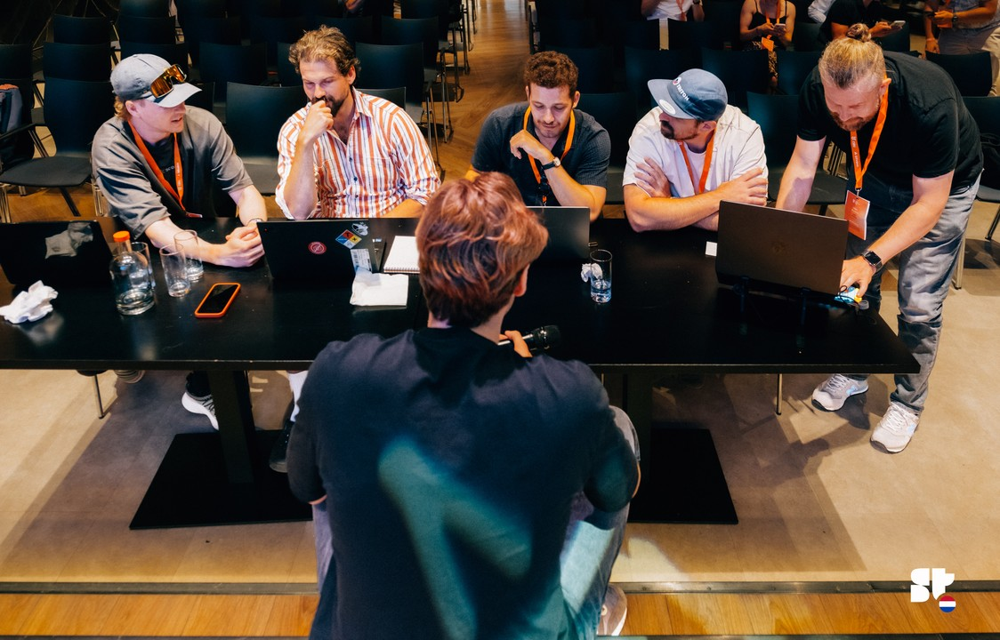
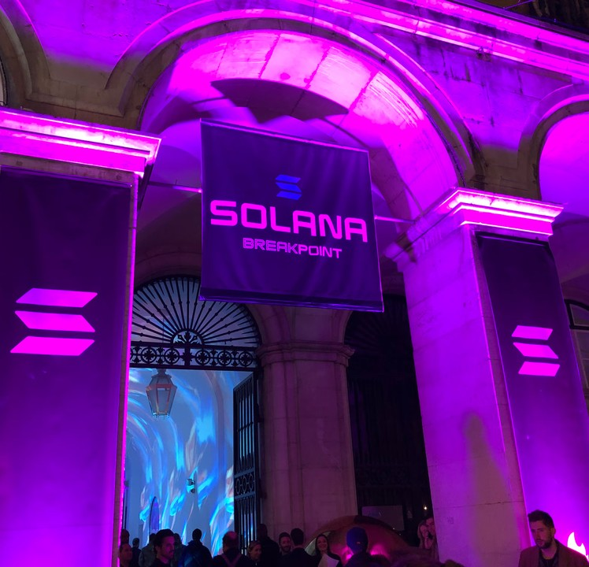
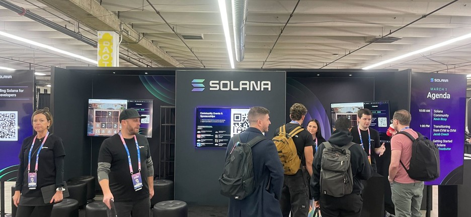

# Build with SODAX on Solana


**No new programs.** Solana is a live, first-class SODAX network, with programs deployed and [independently audited](<../developers/audits/Sodax (Solana) Smart Contract Audit Report - Final Report v2 (1).pdf>). Your users sign familiar Solana transactions, and SODAX coordinates cross-network execution, routing, and recovery behind the scenes.


You keep shipping on Solana. SODAX absorbs the cross-network execution layer, so your product can offer trading and lending against the liquidity of every SODAX-supported network without leaving your stack. Integration happens in TypeScript, at the SDK or React layer. There is nothing to deploy, audit, or maintain on-chain.

Using SODAX is free. Trades carry a fixed 0.1% base fee taken by the protocol, and you set your own platform fee on top. That part is fully yours, both the rate and the revenue. See [Monetize SDK](../developers/packages/sdk/docs/MONETIZE_SDK.md).

Not sure where SODAX fits in your product? Paste your protocol's URL into the generator and get a guide written for your stack:

<a href="https://sodax.com/solana" class="button primary">Generate your integration guide</a>

## What you can build

Two SODAX modules are relevant to Solana builders:

<table data-view="cards"><thead><tr><th></th><th></th><th data-hidden data-card-target data-type="content-ref"></th></tr></thead><tbody><tr><td><strong>Swaps</strong></td><td>Intent-based cross-network swaps. Users trade between SPL assets and assets on any supported network with one signed transaction on Solana. Solvers compete to fill; unified pricing across networks.</td><td><a href="swaps.md">swaps.md</a></td></tr><tr><td><strong>Money Market</strong></td><td>Cross-network lending and borrowing. Depositors source collateral from any supported network and settle into positions that back Solana-native flows: supply, borrow, repay, withdraw.</td><td><a href="money-market.md">money-market.md</a></td></tr></tbody></table>

## Choose your integration path

| Path | Best for | Start here |
| --- | --- | --- |
| [`@sodax/sdk`](../developers/packages/foundation/sdk/README.md) | Full control from any TypeScript backend or frontend | [Quickstart](quickstart.md) |
| [`@sodax/dapp-kit`](../developers/packages/experience/dapp-kit.md) + [`@sodax/wallet-sdk-react`](../developers/packages/connection/wallet-sdk-react.md) | React apps that want hooks and wallet connectivity out of the box | [Wallets](wallets.md) |
| [Builders MCP](https://builders.sodax.com) | Building with AI agents against the full SODAX stack | builders.sodax.com |

## In this section

* [Quickstart](quickstart.md): install the SDK, connect a Solana wallet, make your first cross-network swap.
* [Swaps on Solana](swaps.md): how intents work from a Solana perspective, quoting, fees, and settlement.
* [Money Market on Solana](money-market.md): supply, borrow, repay, and withdraw with cross-network collateral.
* [Wallets](wallets.md): Phantom, Backpack, Solflare, and every other network's wallets through one interface.
* [Networks & Assets](networks-and-assets.md): what is live on Solana today and what your users can reach.
* [Solana FAQ](faq.md): the questions Solana engineers actually ask.

## Out in the ecosystem

You will run into us where Solana builders already are: Breakpoint, Superteam events, hackathon season.

<table data-header-hidden><thead><tr><th></th><th></th><th></th></tr></thead><tbody><tr><td></td><td></td><td></td></tr></tbody></table>

If you are getting oriented in Solana development more broadly, these are the resources we point builders to:

* [**Superteam**](https://superteam.fun/): the global collective of Solana builders: bounties, grants, local chapters, and the fastest way to find collaborators and your first users.
* [**Colosseum**](https://colosseum.com/hackathon): Solana's flagship online hackathon and accelerator. A cross-network swap or lending feature built on SODAX makes a strong hackathon wedge; ship it in a weekend, no programs to write.
* [**Solana developer docs**](https://solana.com/developers): the canonical starting point for the runtime, SPL tokens, and tooling.
* [**Anchor**](https://www.anchor-lang.com/): if you do write programs, this is the framework; SODAX integration lives alongside it in your TypeScript client, not inside it.
* [**Solana Stack Exchange**](https://solana.stackexchange.com/): where the sharp edges get answered.

***

Building something? Generate a guide at [sodax.com/solana](https://sodax.com/solana), or start with the [Quickstart](quickstart.md).
